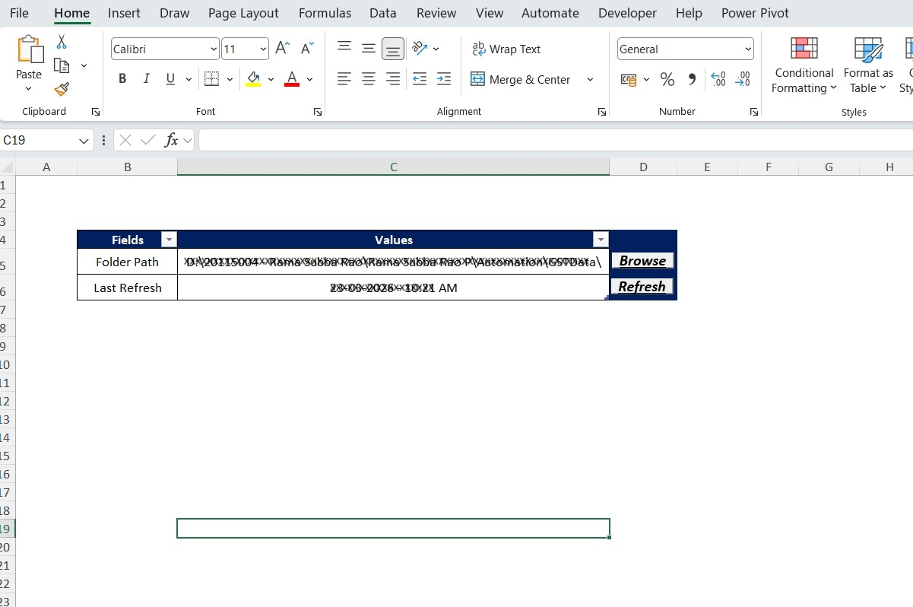
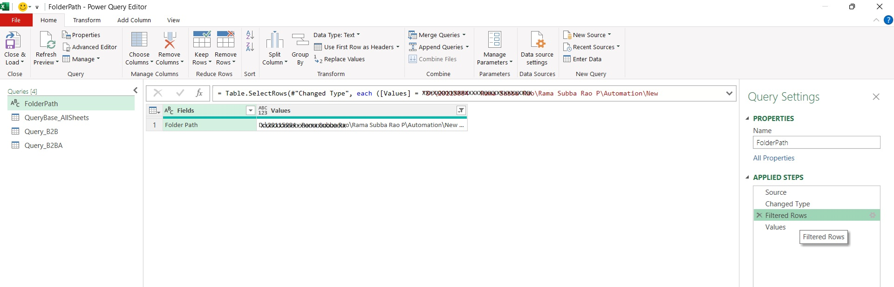
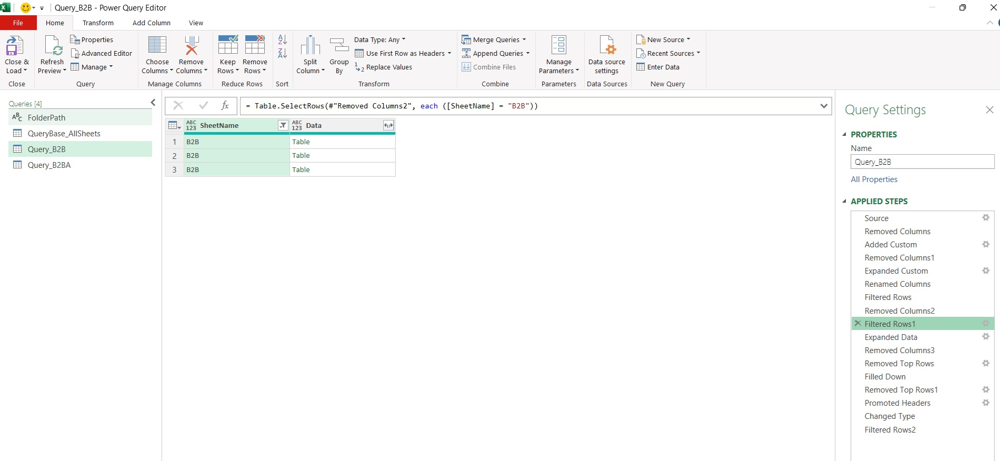
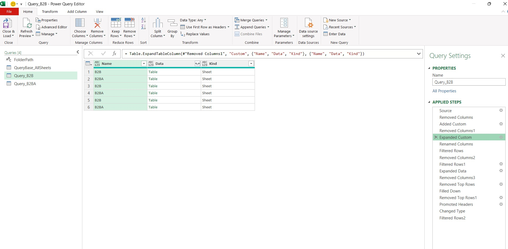
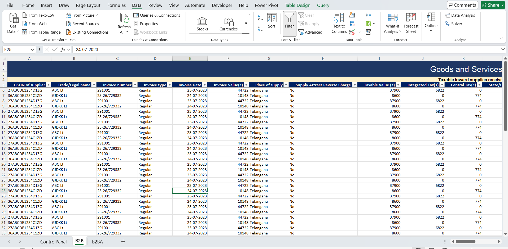

# Excel-data-consolidation-tool
Automated Excel tool using Power Query &amp; VBA for multi-file data consolidation

🚀 Overview

This project is an automated Excel-based solution designed to consolidate data from multiple files and sheets into a single structured dataset. It eliminates manual effort, improves accuracy, and enables scalable monthly reporting.

---

🧩 Problem Statement

Monthly GST data consolidation required manually combining data from multiple Excel files and sheets. This process was:

- Time-consuming
- Error-prone
- Difficult to scale

---

💡 Solution

Developed a reusable Excel template that:

- Dynamically reads files from a selected folder
- Extracts specific sheets (e.g., B2B)
- Cleans inconsistent data (headers, blank rows)
- Appends all data into a unified dataset
- Provides a one-click refresh experience

This solution is designed to hande real-world messy Excel data including inconsistant headers, blank rows, and multi-sheet inputs.

---

🔄 Workflow

Folder → Power Query → Data Cleaning → Append → Output

---

✨ Key Features

- 📁 Dynamic folder path selection via Control Sheet
- 🔄 One-click refresh button using VBA
- 📑 Multi-file & multi-sheet consolidation
- 🧹 Automatic removal of:
  - Duplicate header rows
  - Blank rows
- 📊 Structured output for reporting
- ♻️ Reusable template for monthly use

---

⚙️ Technical Implementation

🔹 Power Query

- Folder-based file ingestion
- Excel.Workbook parsing
- Sheet-level filtering (e.g., B2B)
- Data transformation:
  - Remove top rows
  - Fill down merged headers
  - Promote headers
  - Filter duplicate headers
- Append all files into single dataset

---

🔹 VBA

- Refresh button for all queries
- Folder path selection (browse functionality)
- Refresh timestamp tracking

---

🔹 Control Sheet Design

- User-friendly interface
- Folder path input
- Refresh button
- Status tracking (Last Refresh)

---

🧠 Challenges & Solutions

🔸 Inconsistent Header Rows

- Issue: Headers repeated for each file
- Fix: Filtered rows where header text repeats

---

🔸 Merged Cells in Source Files

- Issue: Incorrect column alignment
- Fix: Used Fill Down before header promotion

---

🔸 Duplicate / Partial Data Extraction

- Issue: Multiple objects (tables/sheets) causing duplication
- Fix: Filtered only required sheet type before expansion

---

🔸 Blank Rows Between Data

- Issue: Gaps between appended datasets
- Fix: Removed rows where key columns are null

---

📈 Impact

- ⏱️ Reduced manual effort by 80–90%
- ✅ Improved data accuracy
- 📊 Faster reporting turnaround
- 🔁 Fully reusable monthly process

---

🎯 Business Value

This tool reduces manual effort and ensures consistent reporting across multiple data sources, making it highly useful for finance, operations, and analytics teams.

---

📸 Screenshots

🔹 ControlPanel (User Interface)

- Folder path selection
- Refresh button
- Last refresh timestamp
- ## Control Sheet
(User will choose the files folder path and press refresh)

- 
  
---

🔹 Power Query Editor

- Folder ingestion
- Sheet filtering
- Transformation steps
  
- ## Power Query Workflow
(Used tranformation techniques like to connect the folder path dynamically to the queries and performed data cleaning activities for each filtered sheet as the data structure is not consistant)
  
- 
  
- 
  
- 
  
---

🔹 Final Output

- Clean consolidated dataset
- Ready for reporting
  
- ## Output
(In the final output we can see different sheets with appended data from different files)
- 

⚠️ Note: Data has been anonymized for confidentiality. Actual file containes 21 seperate sheets for which customised queries are written

---

🛠️ Tools Used

- Microsoft Excel
- Power Query
- VBA

---

▶️ How to Use

1. Open the template file
2. Go to Control Sheet
3. Click Browse and select folder
4. Click Refresh
5. View consolidated data

⚠️ Note: Enable Macros after opening the file for full functgionality

---

🔮 Future Enhancements

- Error log sheet (missing files/sheets)
- Validation checks
- Export to PDF/Excel
- Dashboard reporting

---

👨‍💻 Author

Rama Subba Rao Polamraju

---

⭐ Project Note

This project demonstrates practical Excel automation techniques for handling real-world messy data including inconsistent headers, merged cells, and multi-sheet inputs. 
